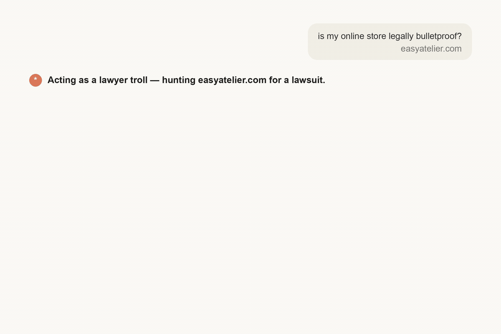

# Agent Skills

[](https://github.com/hashgraph-online/hol-guard)

Skills for Claude Code, Codex, Gemini CLI, Cursor, and anything else that reads
`SKILL.md`. No dependencies, no API keys, no paid services.

| Skill | What it does |
|---|---|
| [site-risk-check](skills/site-risk-check) | Scan a live URL for the conditions that get sites flagged — missing policies, trackers before consent, accessibility gaps. Re-run to see only what changed. |

## Install

```bash
git clone https://github.com/kobimantzur/agent-skills.git && cd agent-skills && ./install.sh
```

`install.sh` symlinks each skill folder into `~/.claude/skills`, `~/.agents/skills`,
and `~/.codex/skills` (whichever exist) — nothing else, no downloads, no root. Read it
first if you like; it is ~20 lines. `git pull` then updates every install.

Claude Code plugin install — **two steps** (the first only registers the marketplace,
the second installs the skill):

```bash
claude plugin marketplace add kobimantzur/agent-skills
claude plugin install site-risk-check@kobimantzur
```

If you did it from inside a Claude Code session with `/plugin`, run `/reload-plugins`
(or restart the session) so the skill loads.

Or, without plugins at all, copy `skills/site-risk-check/` into wherever your agent
reads skills from (`~/.claude/skills/`, `~/.agents/skills/`, `~/.codex/skills/`).

## site-risk-check

**Check if your website could get you sued — before a lawyer's bot finds it first.**

Point it at any URL. It runs the same scan the "ADA trolls" and privacy-demand-letter
firms run — missing privacy/cookie policies, trackers and session recording firing
before consent, accessibility gaps (WCAG) — figures out which countries you sell to,
and tells you in plain English what to fix, how long each fix takes, and what it
typically costs if you don't. The scanner itself is a local Python script (no API key, reads a public page). Note: when you run it *through* an AI agent, that agent sees the page content and the report — the script is local, the agent is not.



### Who it's for

- **Any website that makes money** — if you can be sued, you can be scanned
- **Shopify / WooCommerce / ecommerce stores** — the #1 target for automated demand letters
- **SaaS products** — trackers, cookies, and consent are your biggest exposure
- **Startups & founders** — clear the specific defects automated scanners flag, in an afternoon, before launch or a client handoff
- **Agencies** — run it across every client site you ship

Covers ADA / WCAG accessibility, GDPR & ePrivacy (EU/UK), CCPA/CPRA (California),
CIPA (wiretapping / session-replay claims), and Israel's IS 5568.

### Run it

Ask your AI coding agent, in plain words:

> check if my site is legally covered — myshop.com

Or run the scanner directly:

```bash
python3 skills/site-risk-check/scripts/scan.py https://example.com
```

```
SITE RISK CHECK — https://example.com
Scanned 2026-08-19T15:05:05+00:00  ·  static scan

FINDINGS
  [HIGH] Trackers present with no consent mechanism detected: Meta Pixel
         → Gate these behind a consent banner, or confirm the banner is
           injected client-side (this scan cannot see that).
  [MED ] 14 of 22  tags have no alt attribute
         → Add alt text. Decorative images take alt="".

16 checks run  ·  1 high, 1 medium, 0 low

NOT EVALUATED
  · Contrast ratios, keyboard navigation, focus order, and whether alt text
    is meaningful all require a human or a rendered scan.
```

Recurring — report only what changed:

```bash
python3 skills/site-risk-check/scripts/scan.py https://example.com --state .last-scan.json
```

Exits `1` on any HIGH finding, so it can gate CI.

Get a shareable PDF (self-contained HTML with a homepage screenshot, printed to PDF):

```bash
python3 skills/site-risk-check/scripts/scan.py https://example.com --markets US-CA,EU --html report.html --screenshot shot.png
```

### What it checks

Policy links (privacy, terms, cookies, accessibility, refunds, contact) ·
trackers loading without a consent mechanism · cookies set before consent ·
missing `alt` attributes · missing `lang` · unlabeled form inputs · empty
links and buttons · missing `<h1>` · `target="_blank"` without `noopener` ·
HTTPS and HSTS.

### Client-rendered sites

Static scan is the default and needs nothing. For sites that render in the
browser (React, Vue, base44, Framer…), it detects the shell and stops rather
than guessing, and does a rendered scan **using a browser the agent already
has** (Claude-in-Chrome or Playwright MCP). The skill installs no browser and
no dependencies — if no browser is connected, it says so instead of guessing.

### What it does not check

Static fetch only — client-rendered content is invisible. Automated testing
covers a minority of WCAG success criteria; contrast, keyboard operability,
focus order, and whether alt text is *meaningful* all need a human. It scans
one page and does not crawl.

**Every report states which checks ran and which could not be evaluated. It
does not determine legal compliance and is not legal advice.**

## License

MIT
